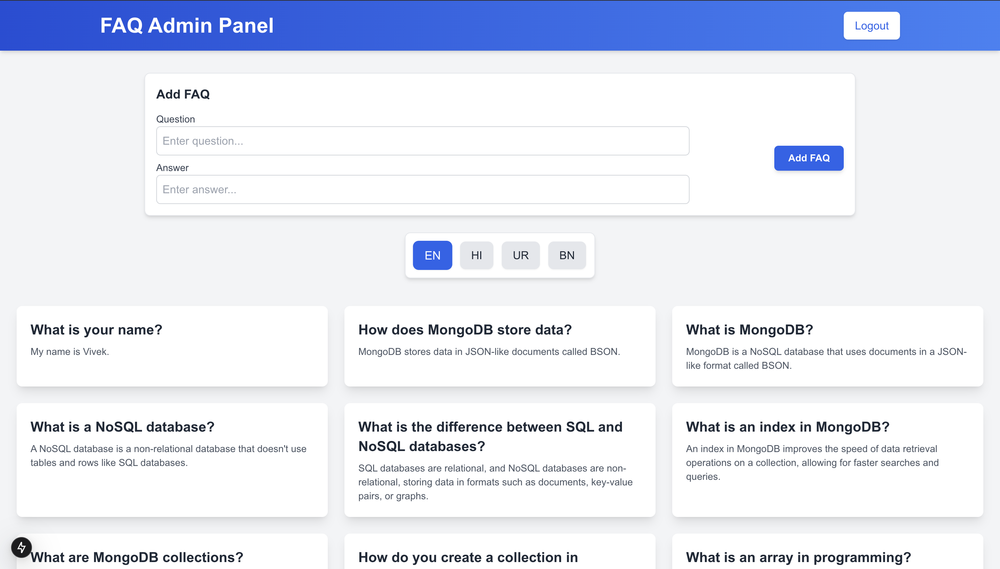
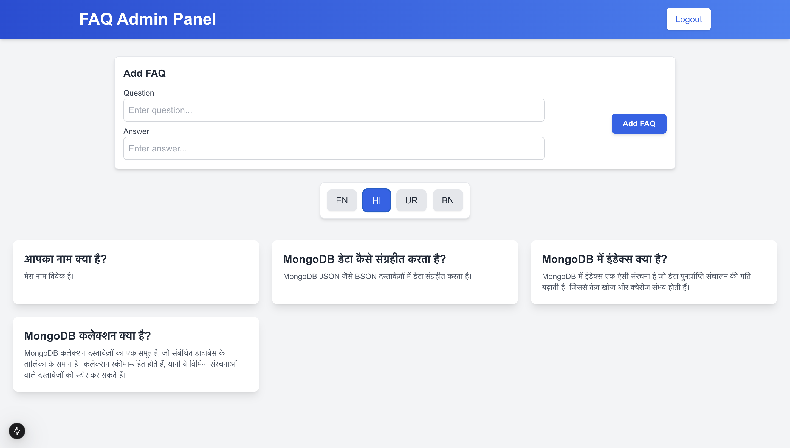

# Frontend Project - FAQ Management UI


## Overview

This project provides the frontend UI for managing **FAQs (Frequently Asked Questions)**. Built using **React.js**, the UI is designed to allow users to view and manage FAQs in an intuitive and responsive way.

---

## Features

- **Display FAQs**: Users can view a list of FAQs.
- **Add FAQ**: Admins can add new FAQs with a question and an answer.
- **Loading & Error States**: Shows loading spinner when data is fetching and an error message if there is an issue.
- **Responsive Design**: The UI is fully responsive, adjusting for desktop, tablet, and mobile screens.

---

## Technologies Used

- **React.js**: For building the user interface.
- **Tailwind CSS**: For styling the components.
- **Axios**: For making API calls to the backend.
- **React Router**: For routing between different pages.
- **React Hooks**: For state management and side effects.

---

## Installation

1. Clone the repository:
   ```bash
   git clone https://github.com/your-username/faq-frontend.git
   ```

2. Navigate to the project directory:
   ```bash
   cd faq-frontend
   ```

3. Install dependencies:
   ```bash
   npm install
   ```

4. Run the application:
   ```bash
   npm start
   ```

   The frontend should now be running at `http://localhost:3000`.

---

## Components

### 1. **FaqForm**
The **FaqForm** component allows admins to add a new FAQ by submitting a question and an answer.

### 2. **FaqList**
The **FaqList** component displays all the FAQs in a grid format. It supports loading, error states, and displaying a message when no FAQs are available.

### 3. **LanguageSelector**
The **LanguageSelector** component allows users to select the language for the FAQs (e.g., English, Hindi, Urdu, Bengali).


---


## Snapshots

### 1. **Admin Panel**
Below is a snapshot of the **Admin Panel** for managing FAQs:


### 2. **FAQ List**
A snapshot of how the FAQs are listed:



---


## Contributing

Feel free to fork this repository and submit pull requests. All contributions are welcome!

1. Fork the repository.
2. Clone your fork:
   ```bash
   git clone https://github.com/your-username/faq-frontend.git
   ```
3. Create a new branch:
   ```bash
   git checkout -b feature-name
   ```
4. Make your changes and commit them:
   ```bash
   git commit -am "Description of the changes"
   ```
5. Push to your branch:
   ```bash
   git push origin feature-name
   ```
6. Open a pull request from your branch.

---

## Contact Developer: Vivek Shaurya

You can reach out to Vivek Shaurya through the following channels:

### 📧 **Email**:
- [vivekshaurya62@gmail.com](mailto:vivekshaurya62@example.com)

### 💻 **GitHub**:
- [Vivek's GitHub Profile](https://github.com/MRPERFECT0603)

### 🔗 **LinkedIn**:
- [Vivek's LinkedIn Profile](https://www.linkedin.com/in/vivek-shaurya/)

### 📱 **Phone**:
- Available upon request

Feel free to reach out for project collaborations, questions, or contributions to open-source projects!


